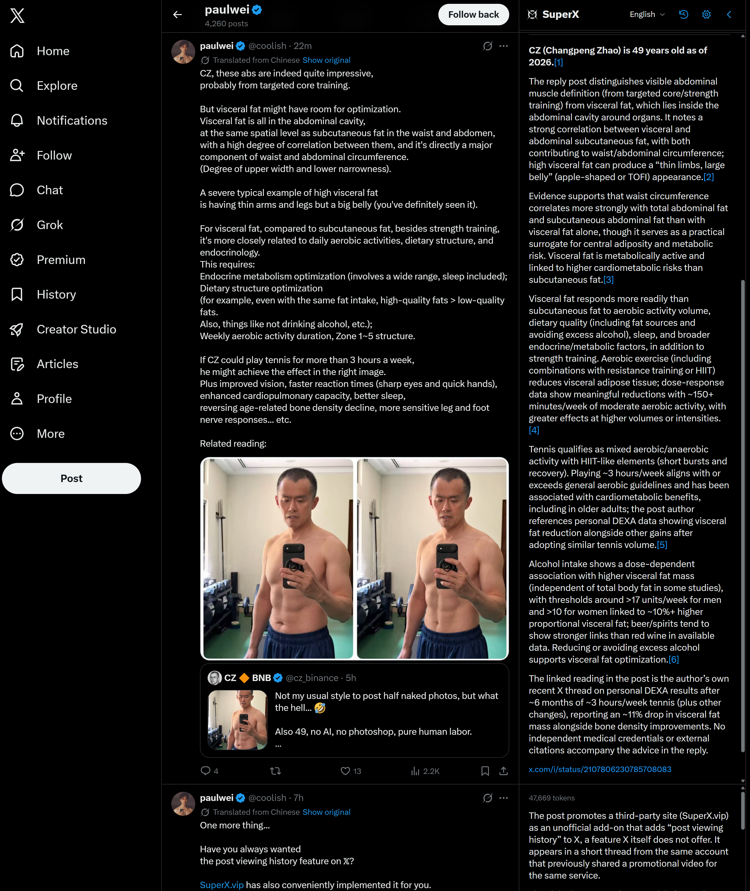

# SuperX

**Understand X. Fact-check as you scroll.**

[Website](https://superx.vip/) · [Download Preview](https://github.com/bwjoke/SuperX/releases/download/v0.7.26/SuperX.zip) · [Support](https://github.com/bwjoke/SuperX/issues) · [简体中文](README.zh-CN.md) · [Privacy](PRIVACY.md)

SuperX is a Chrome / Edge extension that uses the xAI API to explain visible X posts and check their factual claims. Answers stream into a right-hand column that follows X's theme, font and interface language. Your left navigation and original feed keep their layout.

The extension uses Manifest V3 and plain JavaScript. Installation needs no build step or package dependencies. This is a Beta: X's changing page structure, model behavior and API availability can affect results.



*SuperX on X, showing English explanations and fact checks.*

## Downloads and support

| Entry | Purpose | Current status |
| --- | --- | --- |
| Chrome Web Store — Stable | Tested releases, installed and updated by Chrome | Coming Soon |
| [Preview 0.7.26 ZIP](https://github.com/bwjoke/SuperX/releases/download/v0.7.26/SuperX.zip) | Newest preview; extract the installation ZIP and update manually | Published |
| [All GitHub Releases](https://github.com/bwjoke/SuperX/releases) | Versioned installation packages, source and checksums | Available |
| Latest stable ZIP | The exact installation package of the latest stable release | Available after the first stable release |
| [GitHub Issues](https://github.com/bwjoke/SuperX/issues) | Bugs, feature requests and shared support for both channels | Open |

[SuperX.vip](https://superx.vip/) is the website; [bwjoke/SuperX](https://github.com/bwjoke/SuperX) is the project home for source, release notes and support. Preview and Stable use the same code and version sequence; the store can lag behind newer previews. **GitHub's Latest entry means the latest stable release, not the latest preview.** Use the Releases list for the newest preview. See [release channels](docs/RELEASE_CHANNELS.md) for the release and promotion process. [0.7.26 Preview](https://github.com/bwjoke/SuperX/releases/tag/v0.7.26) is published; the Chrome Web Store listing is coming soon.

The user confirmed 0.7.26's core features on Chrome for Windows 11. Installed Edge acceptance remains pending.

## Features

- Visible posts enter the analysis queue immediately, with configurable API concurrency.
- A continuous right column replaces X's original sidebar; collapse it to restore that sidebar.
- Built-in or editable prompts, with separate explanation, fact-check and comment instructions.
- Auto answers follow the post's currently displayed language, including translation / original switches. You can also choose a fixed language.
- Streamed Markdown, clickable sources, per-post Token usage and model details.
- Three optional one-line comment drafts, copied only when you click; SuperX does not post them.
- Local result caching and specific failure details when a fact check cannot finish.
- A searchable, on-device history of posts viewed in the last 24 hours, including already generated answers and comments; available after browser restart.

SuperX's AI features require your own xAI API Key; local browsing history works without one. The X built-in Grok mode and URL-only interpretation mode were removed in version 0.7.0. SuperX is an independent project and is not affiliated with X or xAI.

## Install

Requirements: desktop Chrome or Chromium-based Edge, version 120 or newer, and an xAI API account with access to your chosen model and search tools.

When the store listing is live, it will be the stable installation entry. To try a GitHub preview or install an archived version manually:

1. Open [**Releases**](https://github.com/bwjoke/SuperX/releases), choose a labelled Preview or Stable release and download the attached `SuperX-<version>.zip` or identical `SuperX.zip`. Extract it. Alternatively, download the source and use its `extension/` folder.
2. Open `chrome://extensions` or `edge://extensions` and enable **Developer mode**.
3. Choose **Load unpacked** and select the folder containing `manifest.json`.
4. Open SuperX settings, add your own xAI API Key and save. Enable SuperX and refresh X.

To upgrade, replace the files in the folder you actually loaded, reload the extension, then refresh X. Keep that folder in a permanent location. The GitHub-generated source archive is different from the extension ZIP attached to a release.

Switching from an unpacked installation to the store is a separate installation, with no automatic settings or Key migration currently provided. Disable the old installation first to avoid duplicate analysis, then configure the new one.

## Set up your API Key

Create a Key and configure API billing in the [xAI console](https://console.x.ai/). X Premium and xAI API usage are billed separately.

Use a normal xAI API Key with available credit and access to your selected model and search tools. See [Privacy](PRIVACY.md) for the data sent and the provider's handling.

**Remember Key on this device** is checked on first setup. It encrypts the Key automatically in this browser profile and restores it after browser restart, with no password or unlock step. Uncheck Remember Key and save to remove the encrypted record and local encryption key, keeping your API Key only for the current browser session. Browser sync is not used. **Clear saved Key** removes the encrypted record, encryption key, obsolete Key records, session credential and cache, while keeping your remember preference.

Existing plaintext Keys and usable session Keys from older versions migrate automatically when Remember Key is selected; plaintext records are removed after the encrypted save succeeds. Missing or damaged saved data requires entering the API Key once again. Older password-encrypted records are not decrypted and remain only until successful migration, replacement or clearing. Automatic encryption protects against exposure of the stored ciphertext alone; it does not protect against access to the full browser profile or a compromised device. See [Privacy](PRIVACY.md) for storage details.

Requests go directly from the extension's background worker to `api.x.ai`; the project does not operate a relay server. The Key is not passed to the X page's content script. Analysis uses your Key when SuperX is enabled. Clearing or replacing the Key cancels queued and active requests and clears the session cache; already sent work may still be billed. Read [Privacy](PRIVACY.md), especially on pages that show non-public posts.

## Settings and behavior

The current default model is `grok-4.3`, with 4 concurrent requests. The model name is editable and concurrency can be set from 1 to 8. Availability depends on your xAI account. At least one of **X search** or **Web search** must be enabled: both built-in and custom modes use the original post URL as their primary context and request its full text, including content hidden behind **Show more**. Retrieval can fail; the extension cannot guarantee that a model has obtained every part of a thread or inspected its media.

| Generation flow | What it does |
| --- | --- |
| Explain, then fact-check in the background (default) | Streams an explanation first, then appends a separate fact check; preserves the explanation if that second request fails |
| Single request | Explains and checks the post in one streamed answer |
| Explain only | Explains the post without a separate fact-check request; enabled search tools may still be used |

Custom mode lets you edit all three prompts. Blank instructions use the defaults; each prompt accepts up to 12,000 characters. Saving new prompts affects new tasks. Use **Reanalyze** to apply them to an existing answer. Application rules still enforce the selected language, safe handling of source material and comment output format.

Language settings contain two independent choices, both **Auto** by default. **Grok answer language** first uses the valid language mark on X's currently displayed post text, then falls back to the author's displayed prose. Quoted posts and search results do not choose the language. A fixed answer language overrides translation / original switches. **SuperX interface language** follows X's UI language in Auto; before X has reported a language, it uses the browser interface language. You can choose a fixed interface language for the rail, Settings and popup. Twelve UI languages are supported, with English as fallback. Changing only the interface language preserves answers and in-progress requests.

Collapse the right column with its top chevron; click the SuperX symbol to expand it. Collapse cancels tasks that have not started; started tasks may finish and their results are retained. Leaving a post's viewport cancels queued work immediately and running work after about one second. Backgrounding, refreshing or closing a tab stops that page's tasks. Requests already sent may still be billed.

## Costs and cache

Automatic analysis can generate paid requests for every visible post. All X tabs share the configured request slots; excess work queues. There is no extension-level post-count limit or spending cap. Faster scrolling, more tabs, search tools and **Reanalyze** can increase usage. Background fact checking normally uses two generation requests; comment suggestions use another request. A single request can invoke search tools multiple times. Check pricing and actual charges in the xAI console.

The per-post Token display uses API-reported usage for the current explanation, fact check and comments. Hover it for model and stage details. It does not total earlier reanalyses or all account spending. Cached results show their original usage and that no new usage was incurred for that cache hit; partial or missing statistics are marked rather than estimated.

Completed results are reusable for up to 24 hours within the current browser session, with a limit of 160 entries and approximately 4 MB. Cache identity includes the post, model, answer language, search options, generation flow and effective prompts. Cached results use trusted session storage and are removed when the browser session ends or credentials change. Old persistent caches are removed on upgrade. Expired entries are pruned when the worker starts and when new entries are saved; the 24 hours is a reuse limit, not an exact-time deletion timer within an open session. **Clear cache** removes the session cache. See [Privacy](PRIVACY.md) for what entries contain.

## Browsing history

Open **Browsing history** from the right-column header, extension popup or Settings. It lists supported posts actually visible while SuperX and history recording are enabled, with no dwell delay and no API Key required. Recording is enabled by default. Repeated views of a post are merged and move it to the top; its retention period is 24 hours after the latest view.

The history stores the displayed post text, author, URL, language, viewing times and available generated answers, sources, Token/model details and comment drafts in restricted `chrome.storage.local`. It survives browser restart, is not encrypted or synced, and is bounded to 1,000 posts and approximately 6 MB. Storage limits may remove older entries before 24 hours. It does not preserve a full post archive or save images. Opening, searching or expanding a saved answer makes no API request and does not preload remote images. Opening an original post or source link visits that website.

Search posts, authors and saved answers; remove individual entries or use **Clear history** to delete everything saved there. Turn off **Save browsing history** to stop new records and answer updates without deleting existing entries. Expired records are excluded from history views and pruned on startup, history reads/writes and an hourly background alarm. Browser shutdown, scheduling delays or storage errors can delay physical cleanup; there is no exact-time deletion guarantee.

History is separate from the API result cache: **Clear cache**, clearing/replacing the API Key and ending the browser session do not delete it. **Clear history** does not delete the Key or result cache, and does not erase an answer already displayed in X. Viewing history never automatically resumes analysis. Private or protected posts can be retained if they were visible on a supported page; see [Privacy](PRIVACY.md).

## Future direction

**Let your AI agent understand what you've been reading on X.** A future direction is user-controlled sharing of selected posts and saved explanations from SuperX's browsing history with your own AI agent, giving it context for follow-up research, discussion and writing. Agent integration is not available in the current release.

## Troubleshooting

| Symptom | Check |
| --- | --- |
| No answers | Enable SuperX, save a valid Key, enable at least one search tool and refresh X after installing or reloading |
| Wrong answer language | Select Auto to follow the displayed post, or choose your preferred fixed language; cached answers are separated by target language |
| Fact check incomplete | Expand the result's diagnostic details; possible causes include an output limit, connection failure, language mismatch, timeout, rate limit or account access |
| Requests stop after a rate limit | Wait for your API allowance to recover, then reanalyze manually; SuperX does not automatically pay for retries |
| Unusual sidebar layout | Reload the extension and refresh X; report the page type, browser version and a redacted screenshot |

An answer with sources is not a guarantee of correctness. A fact-check failure preserves the explanation; it does not certify the post or necessarily mean the explanation itself was cut off.

## Development

Use **Node.js 22 or newer**. No `npm install` is needed for the extension, tests or local preview.

```sh
node tools/validate.mjs
node tools/preview-server.mjs
npm run package
```

The validator checks declared resources, JavaScript syntax and automated tests. The preview server prints a local URL and uses simulated storage and answers; it does not read your installed extension's Key or call the paid API. Continuous integration runs the validator and produces installation artifacts. See [Contributing](CONTRIBUTING.md) for development and [the release checklist](docs/RELEASE_CHECKLIST.md) for acceptance status. CI artifacts do not by themselves publish a GitHub Release. The website is maintained separately and is not part of this repository or its source release.

| Folder | Contents |
| --- | --- |
| `extension/` | Files loaded by the browser |
| `tests/` | Automated regression tests with mocked browser and provider APIs |
| `demo/` | Local UI previews using production code |
| `tools/` | Validation, preview and release helpers |
| `docs/` | Release channels, acceptance checklist and the README preview image |

Some internal module and storage names retain GrokFirst identifiers for upgrade compatibility. Changes to them need migration review.

## License

Project code and documentation are available under the [MIT License](LICENSE). The bundled Marked parser retains its [third-party license](extension/marked-LICENSE.txt).

For security reports, follow [SECURITY.md](SECURITY.md). Do not include API Keys or private post contents in public issues.
