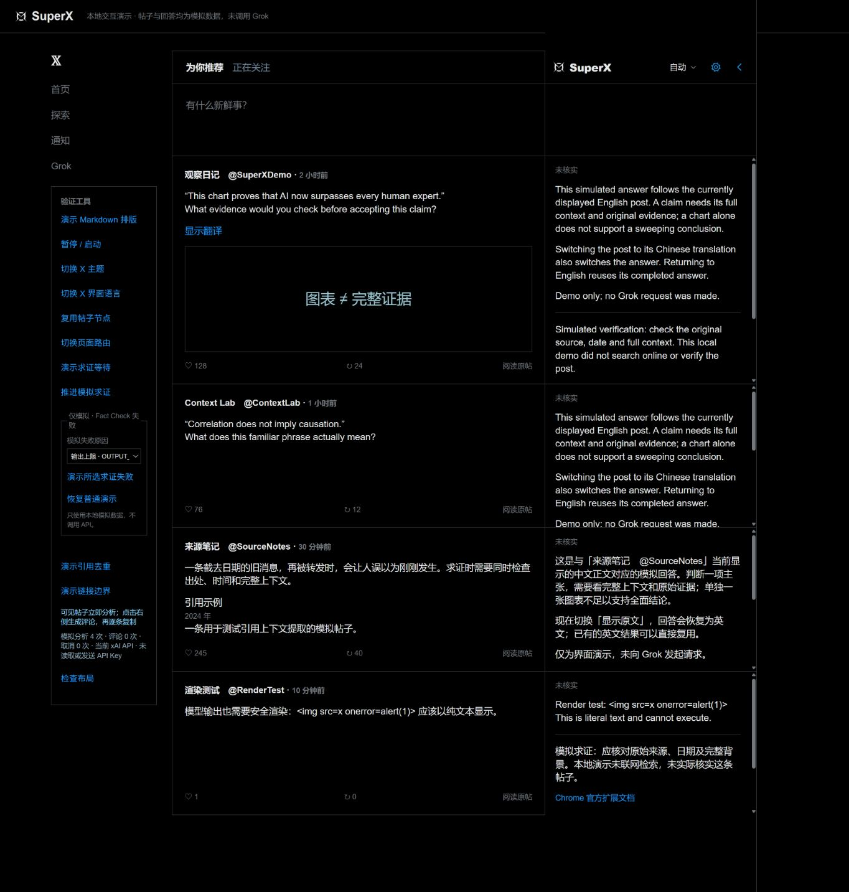

# SuperX

**读懂 X，边刷边核查。**

[官网](https://superx.vip/) · [下载预览版](https://github.com/bwjoke/SuperX/releases/download/v0.7.26/SuperX.zip) · [支持](https://github.com/bwjoke/SuperX/issues) · [English](README.md) · [隐私说明](PRIVACY.md)

SuperX 是 Chrome / Edge 扩展，通过 xAI API 自动解释当前可见的 X 帖子，并核查其中的事实主张。答案流式显示在紧贴信息流的完整右栏，跟随 X 的主题、字体和界面语言，保留左栏及原帖布局。

使用 Manifest V3 和原生 JavaScript，安装无需构建或下载依赖。目前为 Beta；X 页面结构变化、模型表现与 API 可用性会影响结果。SuperX 是独立项目，与 X 或 xAI 没有隶属关系。



*本地演示中的模拟帖子与回答，并非真实 X 页面或付费 API 会话。*

## 下载与支持

| 入口 | 用途 | 当前状态 |
| --- | --- | --- |
| Chrome 商店 · 稳定版 | 经过验收，由 Chrome 安装与更新 | 尚未发布商店页面 |
| [预览版 0.7.26 ZIP](https://github.com/bwjoke/SuperX/releases/download/v0.7.26/SuperX.zip) | 最新候选，解压安装 ZIP，手动更新 | 首次公开发布准备中 |
| [所有 GitHub Releases](https://github.com/bwjoke/SuperX/releases) | 各版本安装包、源码及校验值 | 首次公开发布准备中 |
| [最新稳定版 ZIP](https://github.com/bwjoke/SuperX/releases/latest/download/SuperX.zip) | 与最新商店稳定版相同的安装包 | 首次稳定发布后提供 |
| [GitHub Issues](https://github.com/bwjoke/SuperX/issues) | 两个渠道共用的报错、需求与支持入口 | 仓库公开后开放 |

[SuperX.vip](https://superx.vip/) 是官网；[bwjoke/SuperX](https://github.com/bwjoke/SuperX) 是代码、更新说明和支持的项目主页。预览与稳定版使用同一套源码和递增版本，商店版可以落后于更新的预览版。**GitHub 的 Latest 指最新稳定版，不包含预览版。** 最新预览版请从 Releases 列表下载，发布和晋升流程见 [双渠道说明](docs/RELEASE_CHANNELS.md)。GitHub 公开发布及 Chrome 商店页面尚在准备中，未发布的入口暂不能用于安装。

## 功能

- 可见帖子立即进入队列，可设置 API 并发数，无需停留等待。
- 连续右栏覆盖 X 原右栏，可随时收起、恢复原右栏。
- 内置或自定义 prompt，解释、事实核查和评论指令分别可编辑。
- Auto 跟随帖子当前显示的语言，切换原文／翻译时同步；也可指定固定输出语言。
- 流式 Markdown、可点击出处、每条 Token 用量及模型详情。
- 一键生成三条一句话评论建议，点击复制，不自动发布。
- 本地答案缓存；事实核查失败时保留解释并显示具体诊断。
- 最近 24 小时的本机浏览历史，可搜索看过的帖子及已有回答和评论，重启浏览器后仍可查看。

AI 功能当前仅支持自备 xAI API Key；本机浏览历史无需 Key。X 内置 Grok 无需 Key 模式和链接自然解读模式已在 0.7.0 移除。

## 安装与升级

需要桌面版 Chrome 或 Chromium 版 Edge 120 及以上，以及具有相应模型、搜索工具权限的 xAI API 账号。

商店页面上线后，它会成为稳定版安装入口。尝试 GitHub 预览版或手动安装历史版本时：

1. 打开 [**Releases**](https://github.com/bwjoke/SuperX/releases) 列表，选择标明预览或稳定状态的版本，下载附加的 `SuperX-<版本>.zip` 或内容完全相同的 `SuperX.zip` 并解压。也可下载源码，使用其中的 `extension/` 文件夹。
2. 打开 `chrome://extensions` 或 `edge://extensions`，开启「开发者模式」。
3. 点击「加载已解压的扩展程序」，选择包含 `manifest.json` 的文件夹。
4. 在 SuperX 设置中填写自己的 xAI API Key。保存、启用 SuperX 并刷新 X。

升级时，将新版文件覆盖到实际加载的目录，重新加载扩展，再刷新 X。请把该目录放在固定位置。GitHub 自动生成的源码压缩包与 Release 附加的扩展安装包不同。

从解压版切到商店版属于另一安装，当前不自动迁移设置与 Key。请先停用旧安装，避免重复分析，再配置新安装。

## API Key 与费用

在 [xAI 控制台](https://console.x.ai/) 创建 Key 并配置 API 余额。**X Premium 与 xAI API 分别计费。**

使用普通 xAI API Key 即可，需要账号有可用额度以及所选模型和搜索工具的权限。SuperX 不要求另行勾选数据同意或声明账号设置。发送哪些数据及服务商如何处理，见 [隐私说明](PRIVACY.md)。

首次配置默认勾选「在本机记住 Key」。Key 在当前浏览器配置中自动加密保存，重启浏览器后自动恢复，无需设置密码或手动解锁。取消勾选并保存后，会删除密文和本机加密密钥，仅在本次浏览器会话中保留 API Key，不使用浏览器同步。「清除已保存的 Key」删除密文、加密密钥、旧版 Key 记录、会话凭据和缓存，但不改变保存偏好。

已选择记住 Key 时，已有明文 Key 和旧版仍可用的会话 Key 会自动迁移；加密保存成功后才删除明文记录。保存数据缺失或损坏时，需要重新填写一次 API Key。新版不解密旧版密码加密记录，旧记录仅保留到成功迁移、更换或清除 Key。自动加密可保护单独泄露的已存密文，不能保护整个浏览器配置或已被控制的设备；详见[隐私说明](PRIVACY.md)。

请求由扩展后台直接发送至 `api.x.ai`，项目没有中转服务器；Key 不传入 X 页面的帖子脚本。启用 SuperX 后，分析使用你的 Key。清除或更换 Key 会取消排队与正在进行的请求，并清除会话缓存，但已发送的工作仍可能计费。请阅读 [隐私说明](PRIVACY.md)，尤其是在可能显示非公开帖子的页面。

所有可见帖子都可能产生付费分析。多个 X 标签页共用请求槽，没有插件级条数上限或消费上限。快速滚动、多个标签页、搜索工具和重新分析会增加调用。默认后台求证通常包含两次生成请求，评论建议另用一次请求；同一请求也可能使用多次检索。实际价格、用量及账单以 xAI 控制台为准。取消已发出的请求不保证免除费用。

## 设置与运行方式

当前默认模型为 `grok-4.3`，并发为 4，可分别修改模型名和设置 1–8 路并发；实际可用性取决于 API 账号。必须至少启用「X 搜索」或「网页搜索」之一。

内置与自定义模式都以原帖 URL 为核心上下文，要求工具获取包含 **Show more** 后文字的全文。可见正文、作者、媒体及引用快照是辅助输入。工具可能无法取得全文；插件不保证模型已完整读取线程或查看所有媒体。

| 生成流程 | 行为 |
| --- | --- |
| 先解释，再后台求证（默认） | 先流式解释，再追加独立求证；求证失败时保留解释 |
| 一次生成 | 一次请求中解释并核查，流式输出 |
| 只解释 | 不追加独立求证；仍可能使用已启用的搜索工具 |

自定义模式可编辑解释、求证和评论指令，每项最多 12,000 字符；空白使用默认指令。保存只影响新任务，点击「重新分析」可更新当前答案。固定应用规则仍约束输出语言、来源材料的安全处理和评论输出格式。

语言设置分为两项，默认均为 Auto，互不影响。「Grok 回答的语言」优先使用 X 当前显示正文的有效语言标记，再根据作者当前显示的正文判断；引用帖和搜索资料不决定语言。选择固定回答语言后，不随原文／翻译切换。「SuperX 界面的语言」在 Auto 下跟随 X 的界面语言；还没打开过 X 时使用浏览器界面语言，也可以单独指定右栏、设置和弹窗的固定语言。支持 12 种界面语言，其余回退英文。只切换界面语言不会重新生成回答或中断正在进行的请求。

顶部箭头收起 SuperX，恢复 X 原右栏；点击边缘 Logo 展开。收起取消未开始的任务，已开始任务可能继续完成并保留结果。帖子离开视窗时，排队任务立即取消，已开始任务约一秒后取消。切到后台、刷新或关闭标签页会停止该页任务；已发出的请求仍可能计费。

## Token 与缓存

结果顶部使用 API 返回的真实 Token 数据，包含当前解释、求证和评论；悬停查看模型及分项。不累计先前重新分析或整个账号的用量。缓存注明原生成消耗与本次未新增消耗；缺失或未完成统计不按字符数估算。

完整结果在当前浏览器会话内最多复用 24 小时，最多 160 条、约 4 MB。缓存区分帖子、模型、目标语言、搜索设置、生成流程及实际使用的 prompt。缓存放在受信任的会话存储；关闭浏览器或变更凭据会清除，升级时删除旧版磁盘缓存。后台启动和写入新缓存时清理过期数据，24 小时是复用上限，并非浏览器会话内的精确定时删除。可在设置中「清除缓存」。缓存具体内容见 [隐私说明](PRIVACY.md)。

## 浏览历史

可从右栏顶部、扩展弹窗或设置打开「浏览历史」。SuperX 和历史记录启用时，支持页面上实际可见的帖子立即记录，无需停留或填写 API Key。历史记录默认开启，同一帖子重复浏览会合并并移到最前，按最后浏览时间保留 24 小时。

历史在受限的 `chrome.storage.local` 中保存当前显示的帖子正文、作者、URL、语言、浏览时间，以及已有回答、出处、Token／模型信息和评论草稿。重启浏览器仍可查看，不加密、不使用浏览器同步，最多 1,000 条、约 6 MB；达到容量上限时，较旧条目可能提前移除。它不保存完整帖子存档或图片文件。打开历史、搜索或展开已有回答不会调用 API，也不会预加载远程图片；点击原帖或出处会访问相应网站。

可以搜索帖子、作者和已有回答，删除单条记录或「清空历史」。关闭「保存浏览历史」停止新增记录和回答更新，已有记录保留至到期。到期条目不再显示；后台启动、历史读写及每小时后台清理时移除过期数据。浏览器未运行、调度延迟或存储错误可能延迟实际清理，不保证精确时点删除。

历史独立于 API 答案缓存：清除缓存、清除／更换 Key 和结束浏览器会话不会删除历史；清空历史也不会清除 Key、答案缓存或 X 上已显示的回答。查看历史不会自动恢复分析。支持页面上看见的非公开或受保护帖子也可能保留，详见 [隐私说明](PRIVACY.md)。

## 后续方向

**让你的 AI Agent 也知道你在 X 上看过什么。** 一个未来方向是由用户主动选择，将浏览历史中的帖子和已有解读提供给自己的 AI Agent，作为后续研究、讨论和创作的上下文。当前版本尚未提供 Agent 接入。

## 常见问题

| 情况 | 排查方式 |
| --- | --- |
| 没有输出 | 确认已启用、Key 有效、至少一种搜索工具开启；安装或重载后刷新 X |
| 输出语言不对 | 选 Auto 跟随当前显示正文，或改为固定语言；不同目标语言的缓存分开 |
| 求证未完成 | 展开诊断，检查输出上限、连接、语言不符、超时、限速或权限等原因 |
| 限速后停止请求 | 等 API 限制恢复后手动重新分析；插件不自动付费重试 |
| 右栏布局异常 | 重载并刷新；报告页面类型、浏览器版本及去除隐私的截图 |

有出处的回答仍可能出错。「求证未完成」表示求证阶段未完成，保留的解释既不等于已核实，也不一定被截断。

## 开发与许可

使用 **Node.js 22 及以上**，扩展、测试和本地预览无需 `npm install`。

```sh
node tools/validate.mjs
node tools/preview-server.mjs
npm run package
```

校验覆盖资源、JavaScript 语法和回归测试。本地预览使用模拟存储与回答，不读取已安装扩展的真实 Key，也不调用付费 API。持续集成会运行校验并生成安装包，不自动发布 GitHub Release。贡献流程见 [CONTRIBUTING.md](CONTRIBUTING.md)，验收状态见 [发布清单](docs/RELEASE_CHECKLIST.md)，历史版本见 [CHANGELOG.md](CHANGELOG.md)。部分内部标识保留 GrokFirst 名称以兼容升级。官网独立维护，不包含在本仓库或源码发布包中。

项目代码与文档采用 [MIT 许可证](LICENSE)，Marked 保留其 [第三方许可证](extension/marked-LICENSE.txt)。

安全问题按 [SECURITY.md](SECURITY.md) 处理，请勿在公开 Issue 中放 API Key 或非公开帖子内容。
